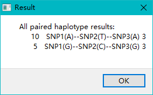
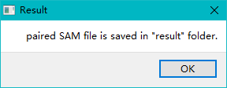

# PerHAPS (Paired-End Reads HAPlotyping for Sequencing)
测试
<br/>


# #1. Download

> - ### Download perhaps_gui.exe and a few public tools (awk.exe, cut.exe, samtools.exe, sort.exe, uniq.exe ) into the "windows_tools" directory. 
> - ### Download example data

```
id=NA20525
wget ftp.sra.ebi.ac.uk/vol1/run/ERR323/ERR3239807/$id.final.cram
samtools index $id.final.cram
samtools view -H XXX.cram | grep "SN:" | head -25 # check if the target BAM file XXX.cram has "chr" prefix

echo "1 159204012 159206500 ACKR1" > subset.bed
echo "19 44905781 44909393 APOE" >> subset.bed
sed -i 's/ /\t/g' subset.bed
samtools view -L subset.bed -O BAM -o $id.subset.bam $id.final.cram
```

<br/>


# #2. RUN
> ### Linux version: Run "perhaps.sh" under "scripts" folder. Only the first 3 lines need to be updated.
> ### Windows GUI version
> > - ### Click perhaps_gui.exe to run the GUI version. The default value is pre-filled, and users only need to click the "submit" button.
> > - ### The Windows version could also be called from the Windwos command terminal
```
python perhaps.py -i NA20525 -d .\test-data -s 1:159205564-159205704-159205737*
```
 







*If users could not see the above images in browser,  this is due to "DNS cache pollution". One short term fix for Windows users is to replace the "hosts" file (usually in "C:\Windows\System32\drivers\etc\hosts") with the "hosts" file posted on this site.*

<br/>


# #3. Visualize

> ### PerHAPS outputs a subset of the input BAM file that only contains paired short reads that are informative for the input haplotype.
> ### Users could use IGV (http://www.igv.org/) to visualize the input BAM file and the output subset BAM file. 
 


<br/>


# #4. Compare
> ## make sure that VCF and BAM files are aligned to the same genome build

```
id=NA20525 # an example sample from G1K
  
# whatshap (https://whatshap.readthedocs.io/en/latest/)
  whatshap phase -o $id.whatshap.vcf --no-reference $id.vcf.gz $id.bam

# HapCUT2 (https://github.com/vibansal/HapCUT2)**	
  extractHAIRS --bam $id.bam --VCF $id.vcf --out $id.fragment
  HAPCUT2 --VCF $id.vcf --fragments $id.fragment --output $id.hap

# Smart-Phase (https://github.com/paulhager/smart-phase)
  java -jar smartPhase.jar -a $id.vcf.gz -p $id -g apoe.b38.bed -r $id.bam -m 60 -x -vcf -c 0.1 -o $id.tsv  

```

<br/>


## Contact & Cite

> - ### [Jie Huang](jiehuang001@pku.edu.cn) MD MPH PhD, Department of Global Health, Peking University School of Public Health
> - ### 2020. Jie Huang, Stefano Pallotti, Qianling Zhou, Marcus Kleber, Xiaomeng Xin, Daniel A. King, Valerio Napolioni. [PERHAPS: Paired-End short Reads-based HAPlotyping from next-generation Sequencing data](https://academic.oup.com/bib/advance-article-abstract/doi/10.1093/bib/bbaa320/6025504). *Briefings in Bioinformatics*


